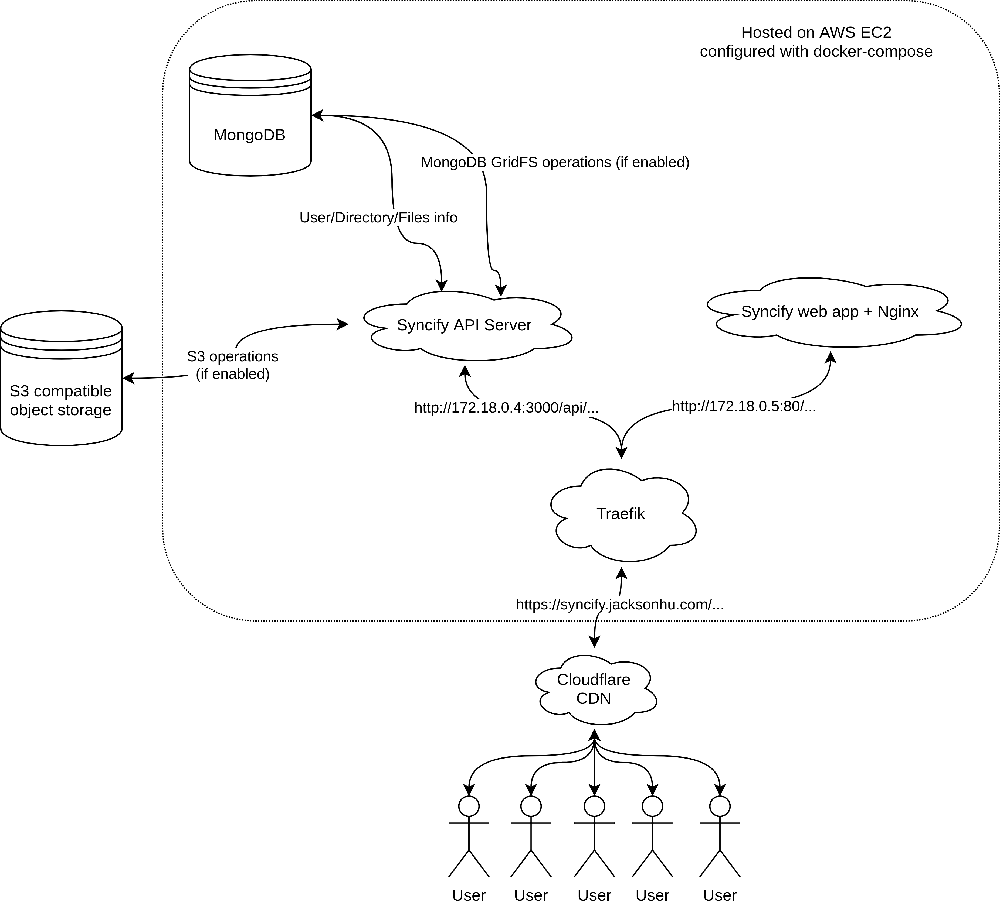
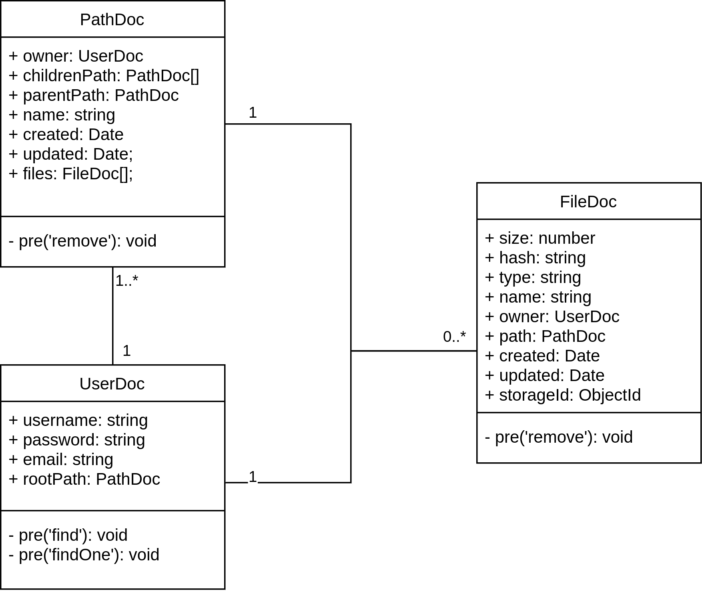
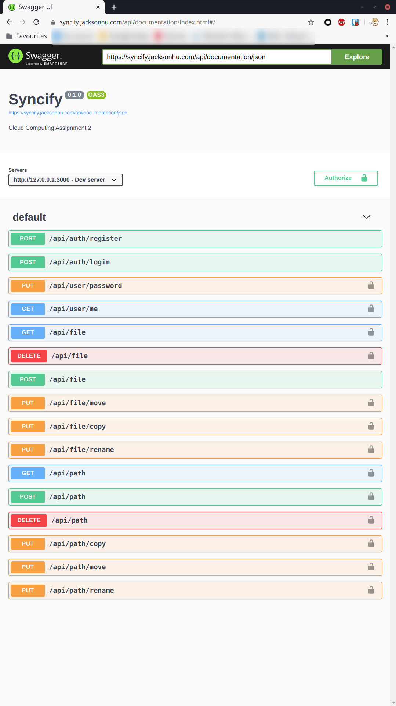
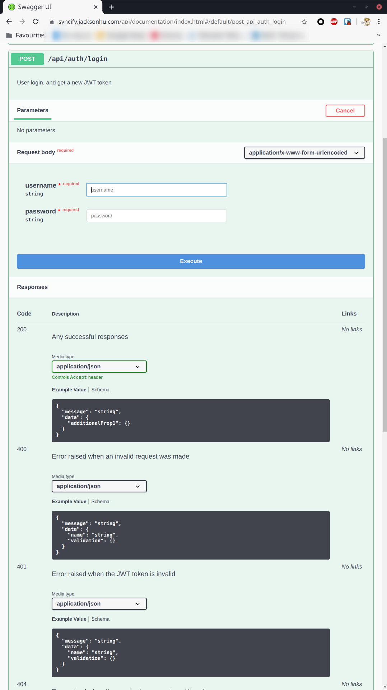
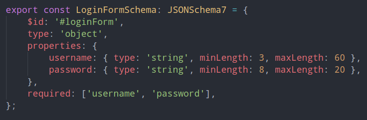
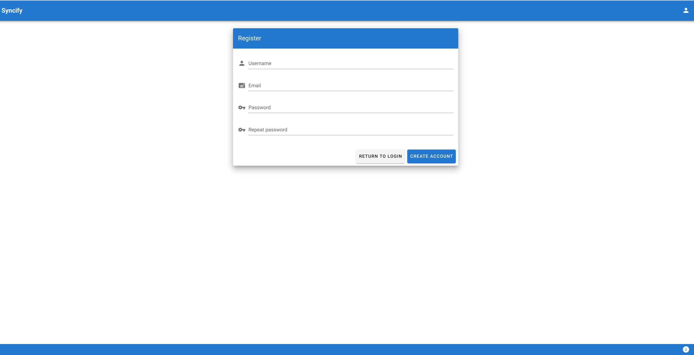
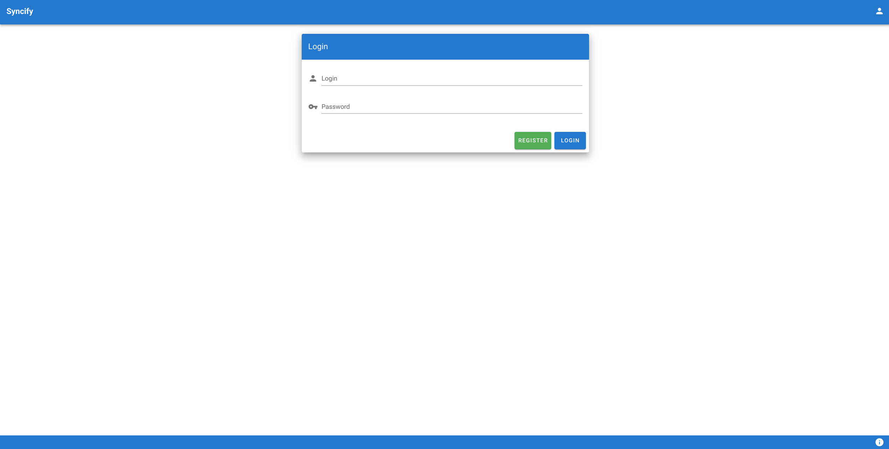
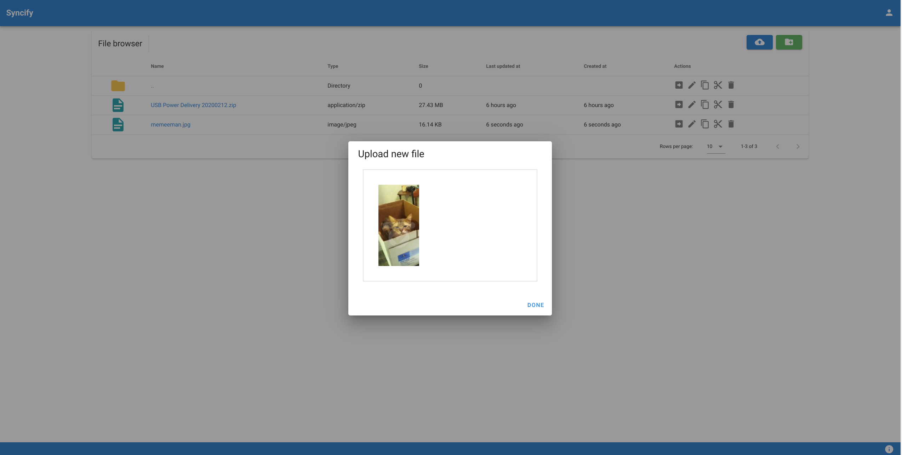
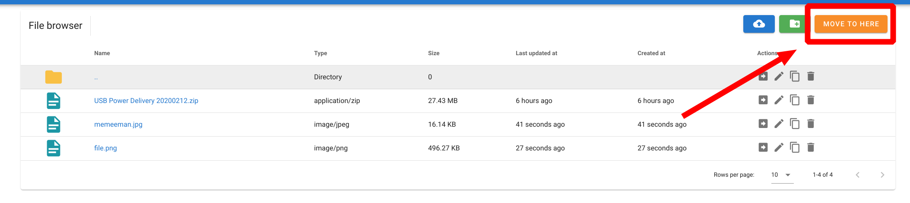
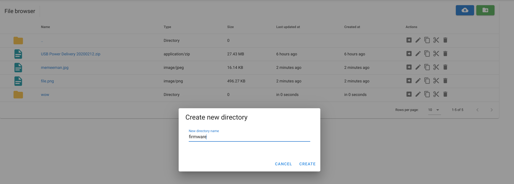

# Implementation

In this chapter, the implementation details will be discussed.

## Project overview 

In general, project make uses of these technical stacks

- Backend API Server
    - Node.js
    - TypeScript
    - Fastify (web framework)
        - fastify-multipart
        - fastify-form
        - fastify-swagger and fastify-oas for Swagger UI + OAS 3.0 feed
    - JWT
    - Argon2 (for password hash)
    - MongoDB 
    - Mongoose (MongoDB ODM)
    - MinIO.js (S3 client)
- Frontend
    - Vue.js 2
    - Vuetify (UI framework)
    - Axios (XHR wrapper)
    - Luxon (time parsing)
    - Dropzone.js (file uploader)
- Deployment
    - Docker
    - Traefik (reverse proxy, Let's Encrypt ACME)

As it mentioned above, this project does not have any Server-side Rendering. Instead, the web UI is a completely separated project apart from the backend API server. The benefits include:

- Saving bandwidth and compute power on the server
- Easier to cache/compress frontend content on CDN
- More flexible 
    - Helps de-coupling
    - Reduce codebase complexity
    - Allows multiple client apps (e.g. Qt-based desktop app, CLI app...)
- Maximising the efficiency on development

## Backend (API Server)

The backend API server is written in Node.js, with TypeScript, Fastify and MongoDB. In this project, we have chosen Mongoose as our Object-Document Mapper. 

### Data structure

This diagram below shows the relationship between the MongoDB documents:

In the diagram, `FileDoc` is the file metadata document. It stores the file's info with a `storageId` mapped to the actual file in the object storage. The `hash` field in the `FileDoc` is reserved for implicit sync purposes in the future. It will be explained later.

The `PathDoc` is the directory tree's node. Directories in this project are stored in a multi-node tree structure. In each directory node, it has one parent and multiple children. There are two ways of traversing or searching the directory tree. For now it is done by brute force, where the user's root directory is populated first, and compare the directory name one-by-one. Apparently, this is not the best approach. There is a new bottom-up way to do so, which starts from the botto to run `findOne()` query with specifying the user ID and directory name, and then compare its parent. For instance, if there is a user ID given with a known path string `/cloud_comp/slides/assets/foo/bar`, the program will do these following steps:

1. Do a `findOne()` with specifying the user ID and directory name `bar`
2. If there is only one document returned, then it must be the directory the user want.
3. If more than one documents are returned, then it should perform **Step 1** for all their parents.
4. Take a record of the directories found.
5. Continue to try **Step 3 and 4** until only one `PathDoc` is returned.

For the `UserDoc`, it records each user's info. The `password` field is a Argon2 hash. Argon2 is an award-winning password hashing algorithm that would against GPU and ASIC password cracking. The `rootPath` field is the root path for that user. On every query, there is a pre-hook function to populate the `rootPath` field.

### API design

This project make uses of the JSON Schema support from Ajv and Fastify. All the requests and responses in this project have their own JSON Schemas. Then with the help from Ajv and fastify-oas plugin, validations and API documentation are done at one stroke. That means, the JSON Schema can be used for both generating API documentations and display it on Swagger UI, plus handling the validations. It also saves a lot of efforts on debugging.

Here are some screenshots for the Swagger UI. The Swagger UI is accessible at `/api/documentation`.

As a reference, here is a section of the JSON Schema for the request on `/api/auth/login` endpoint:

Furthermore, this project uses human-readable path string instead of machine-generated ID in the API request. For example, listing a directories can be done by sending GET request to `/api/path?path=/foo/bar`.

## Frontend (web app)

Initially, this project has chosen React with Material UI as the frontend technical stack, However due to the previous teaming issue, it has been changed to Vue 2 with Vuetify.

Here are some screenshots for the web app:

Register page:

Login page:

File upload:

File move:

Create new directory:

